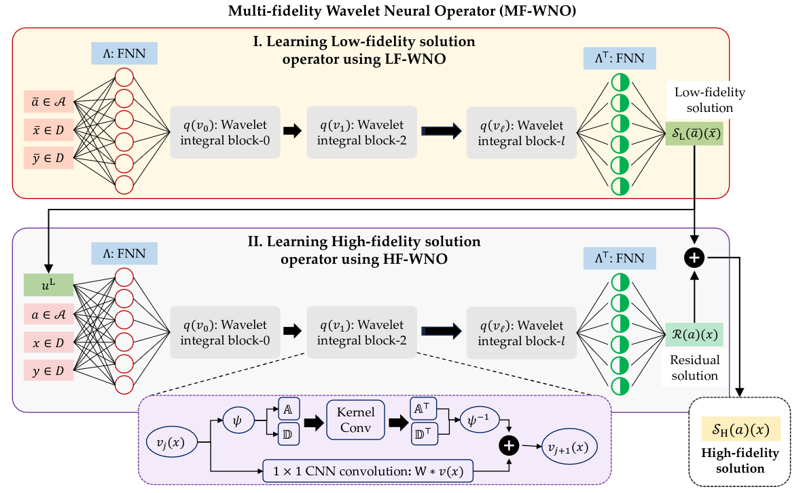

# MFWNO
Multi-fidelity wavelet neural operator surrogate model for time-independent and time-dependent reliability analysis

+ This repository also covers the codes of the following paper 
  > + Thakur, A., Tripura, T., & Chakraborty, S. (2022). Multi-fidelity wavelet neural operator with application to uncertainty quantification. arXiv preprint arXiv:2208.05606. [Article](https://arxiv.org/pdf/2208.05606)

## Architecture of the Multi-Fidelity wavelet neural operator (MFWNO). 


## Files
```
:file_folder: Allen_Cahn                     # Contains files of the Allen Cahn equation.
  |_📂 data                       # Folder for storing DATA and generating data.
    |_📄 Allen_cahn_Init.m                         # Generates random initial conditions for the Allen Cahn equation.
    |_📄 RandField_Matern.m                        # Generates random fields using Mattern kernel.
    |_📄 stationary_Gaussian_process.m             # Contains functions for constructing kernels.
  |_📂 model                      # Folder for storing trained models.
  |_📂 results                    # Folder for storing analysis results post-training.
  |_📄 Data_generation_Allen_Cahn2d.ipynb          # File for training data generation.
  |_📄 Deeponet_multifid_AC_size_20.ipynb          # Sample for training MF-DeepONet.
  |_📄 Multifid_WNO_AC_20_Reliability.ipynb        # Notebook for Reliability analysis of AC with HF 20 data.
  |_📄 Multifid_WNO_AC_20samples.ipynb               # Notebook for time-dependent training MFWNO with HF 20 data.
  |_📄 Multifid_WNO_AC_60_Reliability.ipynb        # Notebook for Reliability analysis of AC with HF 60 data.
  |_📄 Multifid_WNO_AC_60samples.ipynb               # Notebook for time-dependent training MFWNO with HF 20 data.
  |_📄 Multifid_WNO_AC_120_Reliability.ipynb       # Notebook for Reliability analysis of AC with HF 120 data.
  |_📄 Multifid_WNO_AC_120samples.ipynb              # Notebook for time-dependent training MFWNO with HF 20 data.
  |_📄 Multifid_WNO_AC_200_Reliability.ipynb       # Notebook for Reliability analysis of AC with HF 200 data.
  |_📄 Multifid_WNO_AC_200samples.ipynb              # Notebook for time-dependent training MFWNO with HF 20 data.
  |_📄 Predictions_Allen_Cahn.ipynb                # Notebook for plotting predictions of AC.
  |_📄 utils.py                                        # Contains utility functions of dataloader, loss functions, etc. 
:file_folder: Darcy_triangle                # Contains files of the Allen Cahn equation.
  |_📂 data                      # Folder for storing data.
  |_📂 data_generation           # Contains functions for generating data.
    |_📂 code_for_plotting
    |_📂 ensemble_generation
      |_📄 bcvalues.m
      |_📄 main.m
      |_📄 ubc.m
  |_📂 model                     # Folder for storing trained models.
  |_📄 Deeponet_multifid_Darcy_triangle_size_10.ipynb        # Notebook for training MF-DeepONet of 10 data.
  |_📄 Deeponet_multifid_Darcy_triangle_size_20.ipynb        # Notebook for training MF-DeepONet of 20 data.
  |_📄 Deeponet_multifid_Darcy_triangle_size_30.ipynb        # Notebook for training MF-DeepONet of 30 data.
  |_📄 Deeponet_multifid_Darcy_triangle_size_50.ipynb        # Notebook for training MF-DeepONet of 50 data.
  |_📄 MFWNO_Darcy_notch_10_Reliability.ipynb                # Notebook for Reliability analysis of Darcy's with HF 10 data.
  |_📄 MFWNO_Darcy_notch_10samples.ipynb                # Notebook for training MFWNO on Darcys's with HF 10 data.
  |_📄 MFWNO_Darcy_notch_20_Reliability.ipynb                # Notebook for Reliability analysis of Darcy's with HF 20 data.
  |_📄 MFWNO_Darcy_notch_20samples.ipynb                # Notebook for training MFWNO on Darcys's with HF 20 data.
  |_📄 MFWNO_Darcy_notch_30_Reliability.ipynb                # Notebook for Reliability analysis of Darcy's with HF 30 data.
  |_📄 MFWNO_Darcy_notch_30samples.ipynb                # Notebook for training MFWNO on Darcys's with HF 30 data.
  |_📄 MFWNO_Darcy_notch_50_Reliability.ipynb                # Notebook for Reliability analysis of Darcy's with HF 50 data.
  |_📄 MFWNO_Darcy_notch_50samples.ipynb                # Notebook for training MFWNO on Darcys's with HF 50 data.
  |_📄 Predictions_Darcy_notch.ipynb                    # Notebook for plotting predictions of Darcy equation from MFWNO.
  |_📄 utils.py                # Contains utility functions of dataloader, loss functions, etc. 
:file_folder: Poisson_stochastic          # Contains files of the Allen Cahn equation.
  |_📂 data                    # Folder for storing DATA.
  |_📂 model                   # Folder for storing trained models.
  |_📄 Data_generation_Poisson_1d.ipynb               # Generates training data for Poisson's equation.
  |_📄 Deeponet_multifid_Poisson1d_size_10.ipynb      # Notebook for training MF-DeepONet of 10 data.
  |_📄 Deeponet_multifid_Poisson1d_size_20.ipynb      # Notebook for training MF-DeepONet of 10 data.
  |_📄 Deeponet_multifid_Poisson1d_size_30.ipynb      # Notebook for training MF-DeepONet of 10 data.
  |_📄 Deeponet_multifid_Poisson1d_size_50.ipynb      # Notebook for training MF-DeepONet of 10 data.
  |_📄 MFWNO_Poisson_10samples.ipynb                  # Notebook for training MFWNO on Poisson's with HF 10 data.
  |_📄 MFWNO_Poisson_20samples.ipynb                  # Notebook for training MFWNO on Poisson's with HF 20 data.
  |_📄 MFWNO_Poisson_30samples.ipynb                  # Notebook for training MFWNO on Poisson's with HF 30 data.
  |_📄 MFWNO_Poisson_50samples.ipynb                  # Notebook for training MFWNO on Poisson's with HF 50 data.
  |_📄 MFWNO_Poisson_50samples_LFWNO.ipynb              # Sample of training a LF-to-MFWNO model.
  |_📄 MFWNO_Poisson_Reliability10.ipynb              # Notebook for Reliability analysis of Posson's with HF 10 data.
  |_📄 MFWNO_Poisson_Reliability20.ipynb              # Notebook for Reliability analysis of Posson's with HF 20 data.
  |_📄 MFWNO_Poisson_Reliability30.ipynb              # Notebook for Reliability analysis of Posson's with HF 30 data.
  |_📄 MFWNO_Poisson_Reliability50.ipynb              # Notebook for Reliability analysis of Posson's with HF 50 data.
  |_📄 Prediction_poissons.ipynb                      # Notebook for plotting predictions of Poisson's equation from MFWNO.
  |_📄 utils.py                # Contains utility functions of dataloader, loss functions, etc. 
```

## Essential Python Libraries
The following packages are required to be installed to run the above codes:
  + PyTorch ```https://pytorch.org/```
  + PyWavelets - Wavelet Transforms in Python ```https://pywavelets.readthedocs.io/en/latest/```
  + Wavelet Transforms in Pytorch ```https://github.com/fbcotter/pytorch_wavelets```

## BibTex
Support us by citing at,
```
@article{thakur2022multi,
  title={Multi-fidelity wavelet neural operator with application to uncertainty quantification},
  author={Thakur, Akshay and Tripura, Tapas and Chakraborty, Souvik},
  journal={arXiv preprint arXiv:2208.05606},
  year={2022}
}
```
